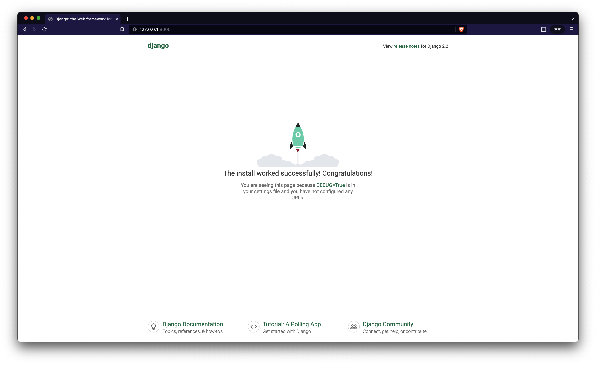

# Simple Django Server

Testing the Django framework

## Required tools

-   [Virtual Box](https://www.virtualbox.org)
-   [Vagrant](https://www.vagrantup.com)
-   [Mod Header](https://chrome.google.com/webstore/detail/modheader-modify-http-hea/idgpnmonknjnojddfkpgkljpfnnfcklj)

## Setup

1.  Make a new git directory

    ```Shell
    mkdir new-app
    cd new-app
    git init .
    git touch .gitignore
    git touch README.md
    git touch LICENSE
    ```

2.  Populate the [.gitignore](./.gitignore) file according to the project
3.  Fill the `README.md` file with relevant information about your project
4.  Add a [License](./LICENSE) (commonly MIT)
5.  Push your project to [GitHub](https://github.com/) using your prefered method ([Desktop App](https://desktop.github.com/), [gh cli](https://cli.github.com/), etc)

## Seting up a virtual machine

1. First init the vagrant box

    ```Shell
    vagrant init ubuntu/bionic64
    ```

    - The `ubuntu/bionic64` initializes the virtual box with that image
        - Check more ubuntu boxes [here](https://app.vagrantup.com/ubuntu)

2. Then modify your [Vagrantfile](./Vagrantfile)

    ```Ruby
    # Standard Configuration
    Vagrant.configure("2") do |config|

    # Vagrant development environment box with version.
    config.vm.box = "ubuntu/bionic64"
    # Versions helps to avoids errors
    config.vm.box_version = "~> 20200304.0.0"

    # Maps a port from a local machine to a server
    # allowing the host and guests to access the app
    config.vm.network "forwarded_port", guest: 8000, host: 8000

    # This command allows you to run scripts in your server
    config.vm.provision "shell", inline: <<-SHELL
        # Disable the auto update
        systemctl disable apt-daily.service
        systemctl disable apt-daily.timer
        # Updates the local repository with required packages
        sudo apt-get update
        # Installs Python3
        sudo apt-get install -y python3-venv zip
        # Set aliases for Python CLI commands
        touch /home/vagrant/.bash_aliases
        if ! grep -q PYTHON_ALIAS_ADDED /home/vagrant/.bash_aliases; then
        echo "# PYTHON_ALIAS_ADDED" >> /home/vagrant/.bash_aliases
        echo "alias python='python3'" >> /home/vagrant/.bash_aliases
        fi
    SHELL
    end
    ```

3. Now you can run your server

    - Set the packages

        ```Shell
        vagrant up
        ```

    - Wait until it finishes and then write

        ```Shell
        vagrant ssh
        ```

    - This will allow you to communicate with the machine using SSH encryption

4. You can now serve files in your virtual computer

    - First move to the computer

        ```Shell
        vagrant@ubuntu-bionic:~$ cd /vagrant
        ```

    - Check the files you have

        ```Shell
        vagrant@ubuntu-bionic:/vagrant$ ls
        # LICENSE  README.md  Vagrantfile  hello.py  ubuntu-bionic-18.04-cloudimg-console.log
        ```

    - Try to run any .py file

        ```Python
        '''hello.py'''

        print('Hello world!')
        ```

        ```Shell
        vagrant@ubuntu-bionic:/vagrant$ python hello.py
        #Hello world!
        ```

## Creating a Django App

-   First create a Python environment
    ```Bash
    vagrant up
    vagrant ssh
    vagrant@ubuntu-bionic:~$  cd /vagrant
    vagrant@ubuntu-bionic:/vagrant$ python -m venv ~/.env
    ```
-   Now you can activate and deactivate it

    ```Bash
    # Activate
    vagrant@ubuntu-bionic:/vagrant$ source ~/.env/bin/activate
    # Chack if the python you are using is the one from your virtual environment
    (.env) vagrant@ubuntu-bionic:/vagrant$ which python
    /home/vagrant/.env/bin/python
    # Deactivate
    (.env) vagrant@ubuntu-bionic:/vagrant$ deactivate
    vagrant@ubuntu-bionic:/vagrant$
    ```

-   Add the required files for your environment

    -   First add your `requirements.txt` file
    -   And add inside that file your dependencies
        ```
        django==2.2
        djangorestframework==3.9.2
        ```
    -   And install them with this command
        ```bash
        (.env) vagrant@ubuntu-bionic:/vagrant$ pip install -r requirements.txt
        ```

-   Now you can start your app i your root folder
    ```bash
    (.env) vagrant@ubuntu-bionic:/vagrant$ django-admin.py startproject profiles_project .
    ```
    -   You'll notice that a new folder called `profiles_project` showed up, this
    -   Now set your profiles:
        ```bsh
        python manage.py startapp profiles_api
        ```
    -   And install your apps inside your `profile_project/settings.py` file
        ```Python
        # profiles_project/settings.py
        INSTALLED_APPS = [
            'django.contrib.admin',
            'django.contrib.auth',
            'django.contrib.contenttypes',
            'django.contrib.sessions',
            'django.contrib.messages',
            'django.contrib.staticfiles',
            # These are the new ones
            'rest_framework',
            'rest_framework.authtoken',
            'profiles_api',
        ]
        ```
-   Now you can test your changes
    -   Start your server
        ```bash
        (.env) vagrant@ubuntu-bionic:/vagrant$ python manage.py runserver 0.0.0.0:8000
        ```
    -   Visit your host at http://127.0.0.1:8000
        

## Setup the database

-   Models
    -   Describe the data we need for our application
    -   Django uses them to set up and configure our database to store our data effectively
    - 
